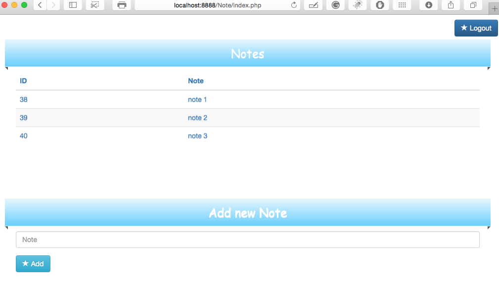
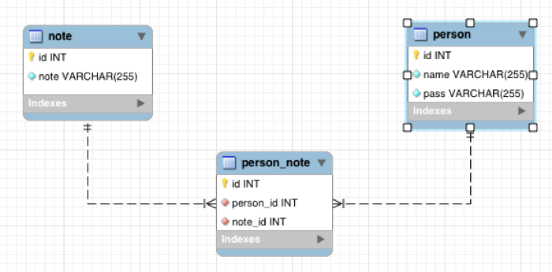
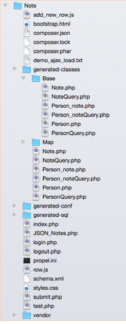

# Website, Propel , PHP

A simple Website with the Login page. . The system cooperates with MySQL databases. All the data are available by the Propel classes connected to the DB. 

## Propel

To access my MySQL database I used PROPEL. Propel uses code generation to build PHP  classes based on schema XML file definition of a data model. Propel also includes a component to manages a connection to Database.

In this assignment I used:

```
* MySQL
* Propel
* PHP
* HTML
* CSS
* JavaScript, jQuery, AJAX
```

## Screenshots

<p align="center">
  
</p>


<p align="center">
  
</p>

## ER diagram, MySQL Database

<p align="center">
  
  
</p>

## Propel classes

<p align="center">
  
  
</p>